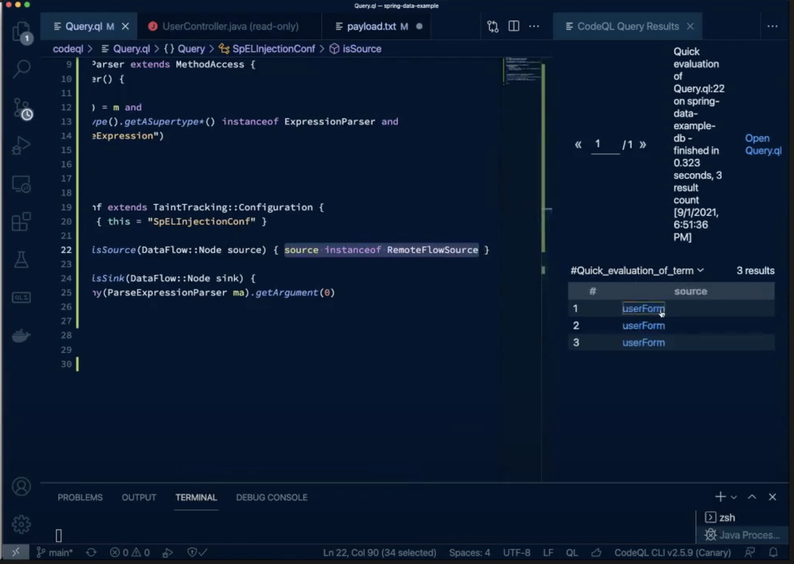
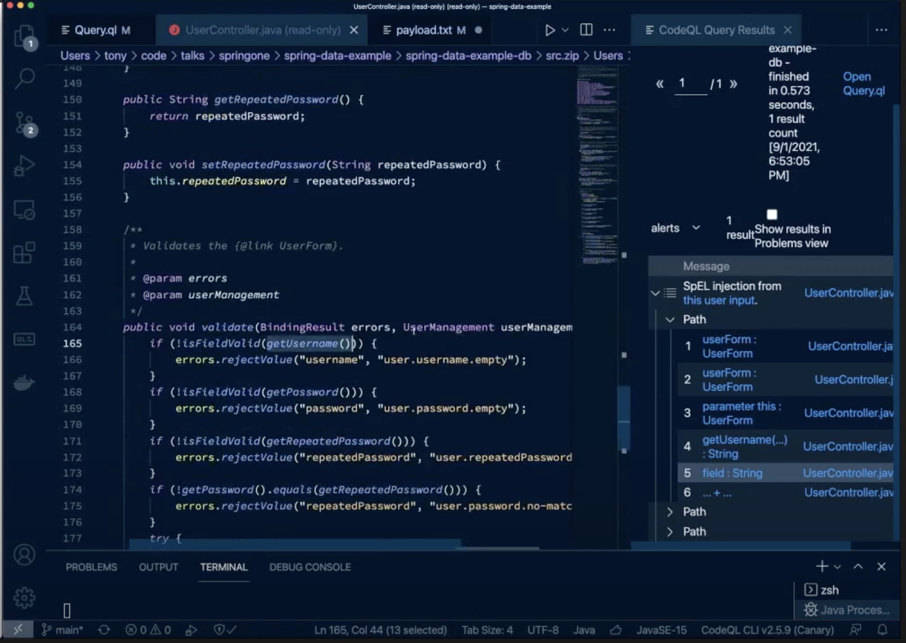

# Security as Code: CodeQLを用いた脆弱性パターンの検出

2021年10月18日

谷口 展郎 (NTT)


## オリジナル

* 発表者
	* Alvaro Muñoz  
	   Staff Security Researcher, GitHub
	* Tony Torralba  
	  Software Engineer, GitHub


* 概要
	* https://springone.io/2021/sessions/security-as-code-a-devsecops-approach
* 動画
	* https://www.youtube.com/watch?v=HQ7oVA0-N1o
* 発表資料
	* https://www.slideshare.net/Pivotal/security-as-code-a-devsecops-approach


## はじめに

### 火星探査機

* Curiosity (9年前)
	* 12次元の配列を受け取る引数に3つしか値の入っていないものを渡すバグ
		* CWE-121:"Access of memory location after end of buffer", CWE-805:"Buffer access with incorrect length value"
	* 単にバグを修正するのではなく，同じパターンをコード内で検索
		* 30件発見
	* ライフサイクル終盤 (火星への飛行中) に発見
		* 莫大な費用がかかった
* 最新の探査機 Perservernce ではライフサイクル初期からCodeQLを導入


### Shifting Security Left

* 誤解
	* It's not just "automate and run earlier"
		* 自動化は良いことだが，それは一部
		* 人やプロセスも考慮すべき
	* Go left(er), don't stop at coding!
	  Requirements, design, architecture ...
		* コーディングだけでやめない
		* コードを書く前に
			* セキュリティ要件を定義して
			* それを設計, アーキテクチャ, コードに適用する


### What motivate us

* (Daniel H. Pink "Drive" より)
	* Autonomy (自律)
		* 開発者がセキュリティ・チームからレポートの束を渡されて対応するのは自律的ではない
	* Mastery (熟達)
		* セキュリティ・チーム内から専門家があれこれ言うだけでは知識の伝搬は行われないし，開発者は自分が知らないことに責任を持てない
	* Purpose (目的)
		* 何のためにセキュリティ対応を行うのかを理解しなければやる気が湧かない


### DevOps => DevSecOps

* ゴール (Purpose) を一致させる
	* チーム間でゴール(KPI)が異なるとうまくいかない
* Autonomy と Mastery
	* Infrastructure as Code: Devが自らOpsの業務に習熟
	* Security as Code: Devが自らSecの業務に習熟


## Security as Code

### 定義

> The methodology of codifying security and policy decisions and socializing them with other teams  
cf. https://cyral.com/white-papers/what-is-security-as-code/

* Responsibility
	* 関係者全員がセキュリティに責任を持つ
* Tooling
	* ポリシーを適用できるツール
		* 例: 開発者がビルド・パイプラインで使える
* More guardrails and fewer Gates
	* Gates (関門) ではなく Guardrail として機能する


### SaC がカバーする範囲

* Security policies
* Security testing
	* 非機能テスト
		* NASAがやったのはこれ以上
* Vulnerability scanning
	* 今から説明する CodeQL はこれ


### CodeQL

* SQL に似た宣言的検索言語
* コードをデータのように扱い検索可能に
* 以下をコードから抽出する
	* 抽象構文木 (AST)
	* 制御フロー・グラフ
* 用途はセキュリティに限定されない


### CodeQL の基本構文

1. `import`: ライブラリー
2. `from`: データベース中のどのテーブルを検索するか
3. (`where`: 条件)
4. `select`: 結果として返される項目


## VS Code を用いたデモ

### コードから全てのメソッドを検索

```
import java

from Method m
//where
select m
```

→ 結果は1万9千メソッド


### 条件節を追加

`RequestMapping` アノテーションを持つメソッドを検索

```
import java

from Method m
where
	exist Annotation a |
		a.getType().getName() = "RequestMapping" and
		a = m.getAnnotation()
select m
```

→ 結果は3メソッド


### オブジェクト指向を用いた再利用

宣言的なだけでなくオブジェクト指向でもある

```
import java

class ControllerMethod extends Method {
	ControllerMethod() {
		exists (Annotation a |
			a.getType().getName() = "RequestMapping" and
			a = thid.getAnnotation()
		)
	}
}

from ControllerMethod m
select m
```

→ 同じ結果が返ってくる


### セキュリティっぽさを足してみる

`@RequestMapping` を持ち，かつ `@PreAuthorize` 持たないメソッドを検索

```
import java

// (omit)

class OpenControllerMethod extends ControllerMethod {
	OpenControllerMethod() {
		not exists (Annotation a |
			a.getType().getName() = "PreAuthorize" and
			a = thid.getAnnotation()
		)
	}
}

from OpenControllerMethod m
select m
```

→ 先の結果から `deleteUser` を除いた2つ


### セキュアな方

```
import java

// (omit)

class SecuredControllerMethod extends ControllerMethod {
	SecuredControllerMethod() {
		not this instanceof OpenControllerMethod
	}
}

from SecuredControllerMethod m
select m
```

→ `deleteUser` が返ってくる


## より実際的なデモ

### ユーザー管理アプリケーション

* ユーザーとパスワードのハッシュを管理/表示するアプリケーション


### 賞金稼ぎ

* ユーザー登録画面で特殊文字 (例: `"`) を入力
	* => エラーになる
		* Springを使っていることがわかる


* SpELを試す
	* サーバー側にファイルを作成  
	  `".isEmpty() && T(java.lang.Runtime).getRuntime().exec("touch /tmp/pwned") && "a`
		* => 成功


## CodeQLでパターンをモデル化


### SINKのモデル化

#### `ExpressionParser` Interface のモデル化

SpELのparserは，通常 `org.springframework.expression.ExpressionParser` Interface を継承しているので，それを探す

```
import java

class ExpressionParser extends Interface {
	ExpressionParser() {
		this.hasQualifiedName("org.springframework.expression", "ExpressionParser")  // evaluate this line
	}
}

// (omit)
```

=> これを評価すると1件の結果が返ってくる


#### メソッド呼び出しのモデル化

実際に探したいのはInterfaceではなくそれを継承したクラスの `parseExpression` メソッド呼び出し

```
// (omit)

class ParseExpressionParser extends MethodAccess {
	ParseExpressionParser() {
		exists(Method m |  // evaluate this `exists` expression
			this.getMethod() =m and
			m.getDeclaringType().getASuperType*() instanceof ExpressionParser and
			m.hasName("parseExpression")
	}
}

// (omit)
```

=> 結果は1件


実際のコードはこうなっている


### Source のモデル化

Spring-specificな入力のモデルを提供しているライブラリーがあるのでそれを使う  
=> 実際に作成するのは SpEL injection の configuration

```
import java
import semmle.code.java.dataflow.TaintTracking
import semmle.code.java.dataflow.FlowSources

// (omit)

class SpELInjectionConf {
	SpELInjectionConf() { this.SpELInjectionConf }

	override predicate isSource(DataFlow::Node source) {
		source instanceof RemoteFlowSource // (2) evaluate this line
	}
	
	override predicate isSink(DataFlow::Node sink) {
		sink.asExpr() = any(ParseExpressionParser ma).getArgument(0) // (1) evaluate this line
	}
}

// (omit)
```

`(1)` を評価すると，1件の結果が返ってくる


`parseExpression` メソッドの第1引数


`(2)` の評価結果は3件



実際のコード


### 最終的なquery

* https://github.com/atorralba/springone-demo/blob/main/codeql/CompleteQuery.ql
* source => sink のパスを表示
* 結果は3件
	* 1つはもともとのバグ
	* 残り2つはその変種


こんな感じでパスを辿ることも可能：


この例だと `isFieldValidate` メソッドの引数となっている `getUsername` メソッドで特殊文字をエスケープする等の対策を取ることが考えられる。




## 終わりに

### CodeQL

* ビルド・パイプラインに容易に統合できる
	* GitHub の `Security` タブ
		* https://atmarkit.itmedia.co.jp/ait/articles/2010/13/news108.html
		* https://docs.microsoft.com/ja-jp/dotnet/architecture/devops-for-aspnet-developers/actions-codeql

* Community Powered
	* https://github.com/github/codeql

### Springサポート

https://www.slideshare.net/Pivotal/security-as-code-a-devsecops-approach/35


## GitHub Secuirty Lab

* 年数百件のCVEを報告
* オープンソース・コンポーネント/ライブラリー向けセキュリティ・アドヴァイザリーの精選されたデータベースを管理
* Cotribution歓迎！
	* https://www.slideshare.net/Pivotal/security-as-code-a-devsecops-approach/35
	* 昨年は10万ドル以上の賞金
	* https://securitylab.github.com/bounties/
